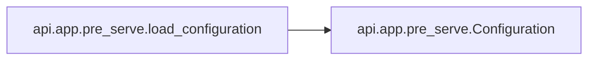

# Api App Pre Serve

[_Documentation generated by Documatic_](https://www.documatic.com)

<!---Documatic-section-Codebase Structure-start--->
## Codebase Structure

<!---Documatic-block-system_architecture-start--->
```mermaid
None
```
<!---Documatic-block-system_architecture-end--->

# #
<!---Documatic-section-Codebase Structure-end--->

<!---Documatic-section-api.app.pre_serve.load_configuration-start--->
## api.app.pre_serve.load_configuration

<!---Documatic-section-load_configuration-start--->


### Object Calls

* api.app.pre_serve.Configuration

<!---Documatic-block-api.app.pre_serve.load_configuration-start--->
<details>
	<summary><code>api.app.pre_serve.load_configuration</code> code snippet</summary>

```python
def load_configuration(filepath: str) -> Configuration:
    try:
        blob = json.load(open(filepath))
        return Configuration(**blob)
    except TypeError as e:
        print("Error loading configuration file %s, maybe you're missing a required field? Exception string: %s" % (filepath, e))
        raise e
    except Exception as e:
        print('Error loading configuration file %s' % filepath)
        raise e
```
</details>
<!---Documatic-block-api.app.pre_serve.load_configuration-end--->
<!---Documatic-section-load_configuration-end--->

# #
<!---Documatic-section-api.app.pre_serve.load_configuration-end--->

[_Documentation generated by Documatic_](https://www.documatic.com)